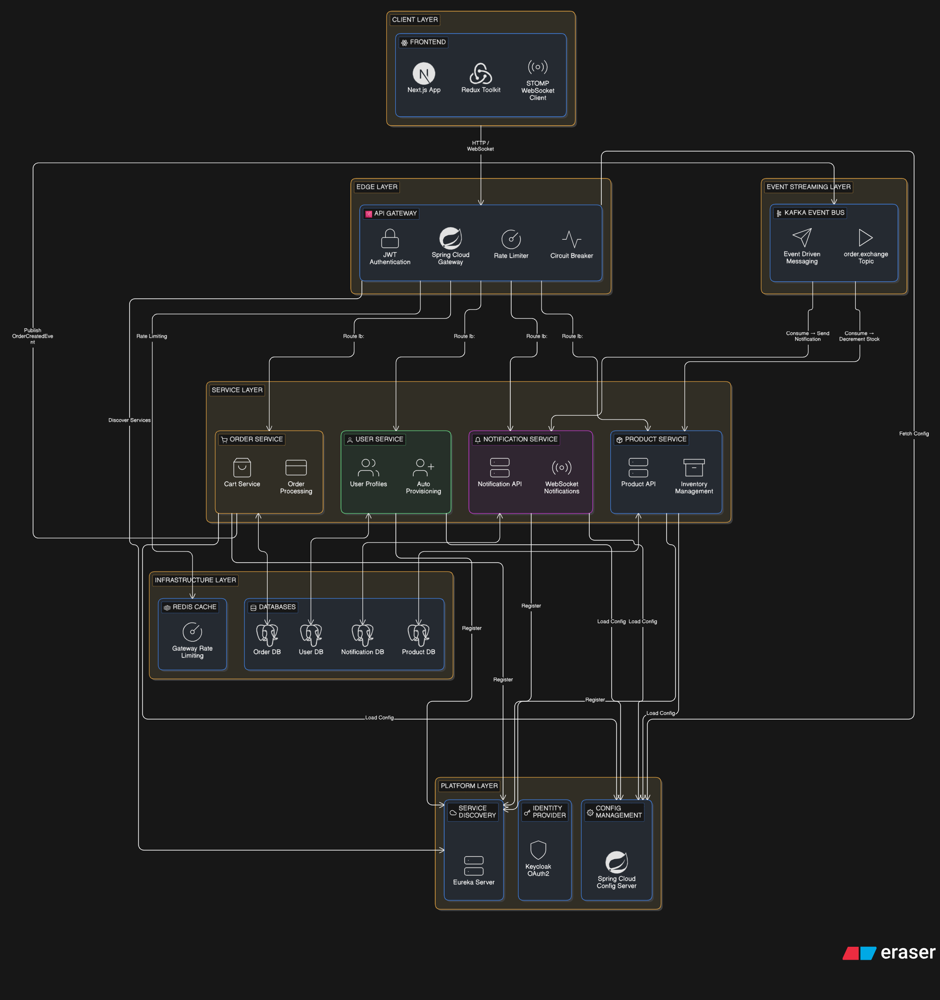
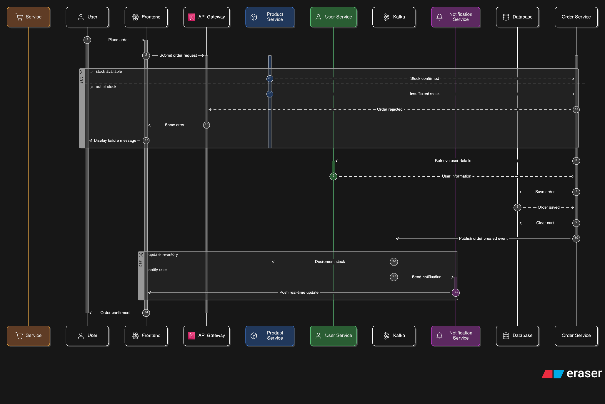

# 🛒 Nimbus Commerce — Microservices E-commerce Platform

A **production-grade, cloud-native ecommerce platform** built with **Spring Boot microservices** and a **Next.js frontend**.

This project demonstrates real-world distributed system patterns including **event-driven architecture, centralized security, resilience patterns, and real-time communication**.

---

## 🎥 Demo Video

[](https://www.youtube.com/watch?v=n_UO73Aiqsc)

---

## 🏗️ Architecture Overview



The system follows a **cloud-native layered microservices architecture**:

- **API Gateway** for routing, authentication, rate limiting, and circuit breaking
- **Eureka Service Discovery** for dynamic service resolution
- **Spring Cloud Config Server** for centralized configuration
- **Keycloak** for OAuth2 / OIDC authentication
- **Kafka** for event-driven communication
- **Redis** for rate limiting
- **PostgreSQL (per service)** for data isolation

---

## 🔄 Order Processing Flow



### Flow Summary

1. User places an order from frontend
2. Request goes through API Gateway → Order Service
3. Order Service:
    - Validates stock via Product Service
    - Fetches user details via User Service
    - Saves order in database
4. Publishes `OrderCreatedEvent` to Kafka

### Event-Driven Processing

- **Product Service** → Consumes event → Decrements stock
- **Notification Service** → Consumes event → Sends real-time notification

> 💡 This event-driven pattern allows services to react independently without tight coupling.

---

## ⚙️ Tech Stack

### Backend
- Spring Boot 3
- Spring Cloud Gateway
- Spring Cloud Eureka
- Spring Cloud Config
- Spring Cloud Stream (Kafka)
- Resilience4j
- PostgreSQL

### Frontend
- Next.js (App Router)
- Redux Toolkit
- MUI (Material UI)
- Keycloak JS
- STOMP + SockJS
- React Hot Toast

### Infrastructure
- Docker Compose
- Apache Kafka (KRaft mode)
- Redis
- Keycloak
- pgAdmin

---

## 🧩 Microservices

| Service | Description |
|--------|------------|
| API Gateway | Routing, JWT validation, rate limiting, circuit breaker |
| Product Service | Product catalog, inventory, soft delete |
| User Service | User profile, auto-provisioning |
| Order Service | Cart, order processing, Kafka event publishing |
| Notification Service | Kafka consumer + WebSocket notifications |

---

## 🚀 Key Features

- ✅ Microservices architecture (5 independent services)
- ✅ API Gateway with centralized security
- ✅ OAuth2 authentication using Keycloak
- ✅ Event-driven architecture using Kafka
- ✅ Async fan-out (single event → multiple consumers)
- ✅ Redis-based rate limiting
- ✅ Circuit breaker & retry (Resilience4j)
- ✅ Real-time notifications using WebSocket (STOMP)
- ✅ Database-per-service pattern
- ✅ Dockerized infrastructure

---

## 🔐 Security

- OAuth2 / OIDC authentication via Keycloak
- JWT validation at API Gateway
- Role-based access control using:

```java
@PreAuthorize("hasRole('ADMIN')")